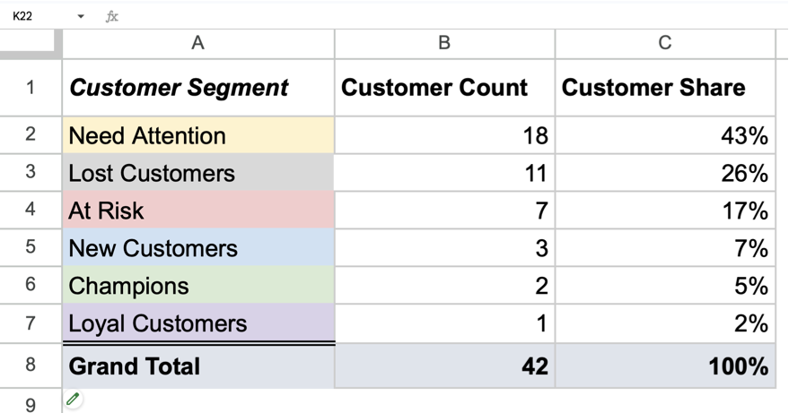

# RFM Müştəri Seqmentasiyası Analizi

## Layihə haqqında

Layihə müştərilərin **Recency** (son alışdan keçən müddət), **Frequency** (alış tezliyi) və **Monetary** (pul xərci) metrikaları əsasında həyata keçirilən müştəri seqmentasiyası analizidir. RFM analizi müştərilərə xidmət göstərilməsi zamanı mövcud olan müxtəlif seqmentlərin fərqləndirilməsi və hərtərəfli marketinq strategiyalarının qurulması üçün istifadə olunan klassik üsuldur.

## Analiz nəticələri

### Seqment bölgüsü (42 müştəri)

| Seqment | Say | Faiz | Təsvir |
| --- | ---: | ---: | --- |
| **Diqqət tələb edən** | 18 | 43% | Uzun müddət alış etməyən, aktiv olmayan müştərilər |
| **İtirilmiş müştərilər** | 11 | 26% | Keçmişdə yüksək dəyərli, lakin hazırda aktiv olmayan müştərilər |
| **Risk altında olan** | 7 | 17% | Azalan aktivlik göstərən müştərilər |
| **Dəyərli və loyal** | 6 | 14% | Yeni, loyal və champion müştərilər |

### Əsas nəticələr

- **Fərdi yönümlü müdaxilə tələbi:** Müştərilərin 43%-i fəal marketinq müdaxilələrinin və müştəri saxlama kampaniyalarının əsas hədəfi olmalıdır.

- **Müştəriləri geri qazanmaq imkanı:** Müştərilərin 26%-ni təşkil edən itirilmiş müştərilərin uğurla geri qazanılması əhəmiyyətli gəlir potensialı təqdim edir.

- **Risklərin idarə edilməsi:** Müştərilərin 17%-ni təşkil edən risk qrupunun strukturlaşdırılmış kommunikasiya və xüsusi təkliflər vasitəsilə saxlanması kritik əhəmiyyət daşıyır.

- **Dəyərli seqmentin böyümə potensialı:** Loyal və champion müştərilərdən ibarət 14%-lik seqmentə uzunmüddətli dəyər yaratmaq üçün prioritet verilməlidir.

## Metodoloji yanaşma

### RFM metrikaları

**Recency (son alışdan keçən müddət):**

- Son alış tarixindən bu günə qədər keçən günlərin sayı
- Azalan dəyərlərə daha yüksək bal verilir
- Müştərinin cari aktivliyinin göstəricisidir

**Frequency (alış tezliyi):**

- Müəyyən dövr ərzində müştərinin etdiyi alışların ümumi sayı
- Müştərinin sadiqlik səviyyəsini göstərir
- Daha çox alış = daha yüksək bal

**Monetary (pul xərci):**

- Müştərinin ümumi xərclədiyi məbləğ
- Müştərinin ömürboyu dəyərini (CLV) ölçür
- Daha çox xərc = daha yüksək bal

### Seqmentasiya modeli

RFM balları 1–5 diapazonunda hesablanıb və müştərilər aşağıdakı kateqoriyalara ayrılıb:

- **Champion:** yüksək R, yüksək F, yüksək M
- **Loyal:** orta–yüksək F, yüksək M
- **Potensial:** orta R, orta–yüksək F
- **Risk altında:** aşağı R, orta–yüksək F
- **Yeni:** yüksək R, aşağı F
- **İtirilmiş:** aşağı R, aşağı F, aşağı M
- **Diqqət tələb edən:** çox aşağı R

## Marketinq tövsiyələri

### Seqmentlərə uyğun strategiyalar

#### 1. Diqqət tələb edən müştərilər (43%)

- **Məqsəd:** Müştərilərin aktivləşdirilməsi və saxlanılması
- **Taktikalar:**
  - Fərdiləşdirilmiş e-poçt kampaniyaları və xüsusi təkliflər
  - Geri qazanma (win-back) kampaniyaları
  - Müştəri rəyi sorğularının keçirilməsi və tənqidlərin qəbul edilməsi
  - Xüsusi endirimlərin və promo-kodların təklif edilməsi

#### 2. İtirilmiş müştərilər (26%)

- **Məqsəd:** Müştərilərin geri qazanılması
- **Taktikalar:**
  - Məhdudmüddətli təkliflər
  - Keçmiş alışlar əsasında fərdiləşdirilmiş xəbərlər
  - Telefon vasitəsilə birbaşa əlaqə
  - Yüksək dəyərli müştərilərə fərdi menecer xidmətinin təqdim edilməsi

#### 3. Risk altında olan müştərilər (17%)

- **Məqsəd:** Aktivliyin saxlanılması və azalmanın qarşısının alınması
- **Taktikalar:**
  - Müntəzəm əlaqə və əlavə dəyər yaradan layihələr
  - Loyallıq proqramı üzrə promosyonlar
  - Müştəriləri geri cəlb etmək üçün yeni məhsul və xidmətlərin təqdimatı

#### 4. Dəyərli və loyal müştərilər (14%)

- **Məqsəd:** Uzunmüddətli sadiqliyin inkişaf etdirilməsi
- **Taktikalar:**
  - VIP müştəri proqramları
  - Eksklüziv xidmətlər və xüsusi istəklərin qarşılanması
  - Tövsiyə (referral) proqramlarında iştiraka dəvət
  - Premium xidmət səviyyəsi və dəstək
 
## Layihə faylları

| Fayl | Təsvir |
| --- | --- |
| [İcra xülasəsi](./EXECUTIVE_SUMMARY_AZ.md) | Əsas nəticələr, maliyyə təsiri, KPI-lər və fəaliyyət planı |
| [Texniki sənədləşdirmə](./TECHNICAL_DOCUMENTATION_AZ.md) | RFM metodologiyası, ballandırma qaydaları və seqmentasiya modeli |
| [Ətraflı analiz hesabatı](./RFM_Customer_Segmentation_Analysis.pdf) | Layihənin ətraflı PDF hesabatı |
| [Seqment bölgüsü](./RFM_Segment_Distribution.png) | RFM seqmentlərinin vizualizasiyası |
| [Google Sheets cədvəli](https://docs.google.com/spreadsheets/d/12f54f_u2A40CAW-4Dzyxd47TbatsIT_qM3rk7rJS4X0/edit?gid=373711621#gid=373711621) | Analizdə istifadə olunan işçi cədvəl |

`RFM Analysis` · `Pivot Table` · `Müştəri Seqmentasiyası`
